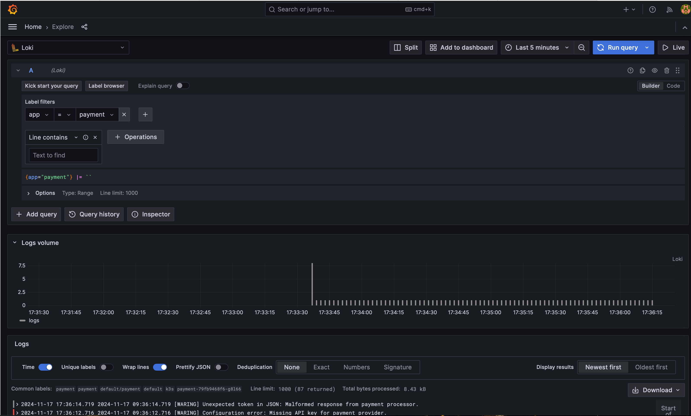

# iac_app
```
cd iac_app/iac/k3s 
export TF_VAR_secret_key=XXX
export TF_VAR_secret_id=XXX
terraform apply --auto-approve
......
Apply complete! Resources: 24 added, 0 changed, 0 destroyed.

Outputs:

grafana_url = "http://101.32.3.224:31001"
kube_config = "./config.yaml"
loki_password = "loki123"
loki_url = "http://101.32.3.224:31000"
public_ip = "101.32.3.224"
vm_password = "password123"       
```

```
cd app
docker build --platform linux/amd64 -f Dockerfile -t chat_ops_payment_app:v2 .
......
Successfully built 2eb1310eb8f6
Successfully tagged chat_ops_payment_app:v2
docker save -o app.tar chat_ops_payment_app:v2 

scp app.tar ubuntu@101.32.3.224:/home/ubuntu/
ubuntu@101.32.3.224's password: 
app.tar                
```

```
ssh ubuntu@101.32.3.224
......
sudo ctr -n k8s.io images import app.tar 
unpacking docker.io/library/chat_ops_payment_app:v2 (sha256:3fbef4919206ea9027e74a8b8754de4576f9b259fc60eb6bbb0d968724d2e518)...done
```

```
cd app
export KUBECONFIG=/home/ymin/git/SpaceStarX/AIOps/module_9/demo_3/iac_app/iac/k3s/config.yaml

kubectl apply -f deployment.yaml       
deployment.apps/payment created
service/payment created 

kubectl apply -f ollama-deployment.yaml
deployment.apps/ollama-model-server created
service/ollama-service created 

kubectl get po   
NAME                                   READY   STATUS              RESTARTS   AGE
ollama-model-server-7788cb479-dxphq    1/1     Running             0          6m58s
payment-79fb9468f6-g8l66               1/1     Running             0          77s
```

```
curl http://101.32.3.224:31143/api/chat -d '{
  "model": "qwen2:0.5b",  
  "messages": [
    {
      "role": "system",
      "content": "以海盗的口吻简单作答。"
    },
    {
      "role": "user",
      "content": "天空为什么是蓝色的？"
    }
  ],
  "stream": false
}'
{"model":"qwen:1.5b","created_at":"2024-11-17T10:17:05.51027508Z","message":{"role":"assistant","content":"因为太阳光中的红光和紫光波长较长，被大气层中的气体分子散射后，最终呈现为蓝色。"},"done_reason":"stop","done":true,"total_duration":2200611470,"load_duration":26075592,"prompt_eval_count":27,"prompt_eval_duration":427000000,"eval_count":29,"eval_duration":1062000000}
```

access grafana http://101.32.3.224:31001/



# operator
```
go mod init llm-log-operator
go: creating new go.mod: module llm-log-operator
```

```
kubebuilder init --domain=aiops.com
INFO Writing kustomize manifests for you to edit...
INFO Writing scaffold for you to edit...
INFO Get controller runtime:
$ go get sigs.k8s.io/controller-runtime@v0.19.0
INFO Update dependencies:
$ go mod tidy
Next: define a resource with:
$ kubebuilder create api
```

```
kubebuilder create api --group log --version v1 --kind LogPilot
INFO Create Resource [y/n]
y
INFO Create Controller [y/n]
y
INFO Writing kustomize manifests for you to edit...
INFO Writing scaffold for you to edit...
INFO api/v1/logpilot_types.go
INFO api/v1/groupversion_info.go
INFO internal/controller/suite_test.go
INFO internal/controller/logpilot_controller.go
INFO internal/controller/logpilot_controller_test.go
INFO Update dependencies:
$ go mod tidy
INFO Running make:
$ make generate
mkdir -p /home/ymin/git/SpaceStarX/AIOps/module_9/demo_3/operator/bin
Downloading sigs.k8s.io/controller-tools/cmd/controller-gen@v0.16.4
/home/ymin/git/SpaceStarX/AIOps/module_9/demo_3/operator/bin/controller-gen object:headerFile="hack/boilerplate.go.txt" paths="./..."
Next: implement your new API and generate the manifests (e.g. CRDs,CRs) with:
$ make manifests
```

update /api/v1/logpilot_types.go

update internal/controller/logpilot_controller.go

```
make manifests
/home/ymin/git/SpaceStarX/AIOps/module_9/demo_3/operator/bin/controller-gen rbac:roleName=manager-role crd webhook paths="./..." output:crd:artifacts:config=config/crd/bases
```

```
make install
/home/ymin/git/SpaceStarX/AIOps/module_9/demo_3/operator/bin/controller-gen rbac:roleName=manager-role crd webhook paths="./..." output:crd:artifacts:config=config/crd/bases
/home/ymin/git/SpaceStarX/AIOps/module_9/demo_3/operator/bin/kustomize build config/crd | kubectl apply -f -
customresourcedefinition.apiextensions.k8s.io/logpilots.log.aiops.com unchanged                                           
```

update config/samples/log_v1_logpilot.yaml

```
kubectl apply -f config/samples/log_v1_logpilot.yaml
kubectl delete -f ../iac_app/app/deployment.yaml
kubectl apply  -f ../iac_app/app/deployment.yaml
```

```
make run
/home/ymin/git/SpaceStarX/AIOps/module_9/demo_3/operator/bin/controller-gen rbac:roleName=manager-role crd webhook paths="./..." output:crd:artifacts:config=config/crd/bases
/home/ymin/git/SpaceStarX/AIOps/module_9/demo_3/operator/bin/controller-gen object:headerFile="hack/boilerplate.go.txt" paths="./..."
go fmt ./...
go vet ./...
go run ./cmd/main.go
2024-11-17T19:29:05+08:00	INFO	setup	starting manager
2024-11-17T19:29:05+08:00	INFO	starting server	{"name": "health probe", "addr": "[::]:8081"}
2024-11-17T19:29:05+08:00	INFO	Starting EventSource	{"controller": "logpilot", "controllerGroup": "log.aiops.com", "controllerKind": "LogPilot", "source": "kind source: *v1.LogPilot"}
2024-11-17T19:29:05+08:00	INFO	Starting Controller	{"controller": "logpilot", "controllerGroup": "log.aiops.com", "controllerKind": "LogPilot"}
2024-11-17T19:29:08+08:00	INFO	Starting workers	{"controller": "logpilot", "controllerGroup": "log.aiops.com", "controllerKind": "LogPilot", "worker count": 1}
preTimeStamp: 1731842911


startTime: 1731842906000000000, endTime: 1731842948000000000
lokiURL:  http://101.32.3.224:31000/loki/api/v1/query_range?query=%7Bapp%3D%22payment%22%7D+%7C%3D+%60ERROR%60&start=1731842906000000000&end=1731842948000000000
result:  [map[stream:map[app:payment container:payment filename:/var/log/pods/default_payment-79fb9468f6-klvp4_01b2ba92-da29-4cfb-b131-c33dc6c164f4/payment/0.log job:default/payment namespace:default node_name:k3s pod:payment-79fb9468f6-klvp4 stream:stdout] values:[[1731842927599000000 2024-11-17 11:28:47.599 [ERROR] Fraud detection failed: Payment flagged as potentially fraudulent.] [1731842917592000000 2024-11-17 11:28:37.592 [ERROR] Memory OOM: Container 'payment-service' exceeded memory limit.] [1731842915590000000 2024-11-17 11:28:35.590 [ERROR] Service 500 Error: Downstream service 'order-processing' returned status code 500.] [1731842913588000000 2024-11-17 11:28:33.588 [ERROR] Database connection failed: Unable to connect to database at 'db.payment.local'.] [1731842907582000000 2024-11-17 11:28:27.582 [ERROR] Fraud detection failed: Payment flagged as potentially fraudulent.]]]]
lokiLogs:  {"status":"success","data":{"resultType":"streams","result":[{"stream":{"app":"payment","container":"payment","filename":"/var/log/pods/default_payment-79fb9468f6-klvp4_01b2ba92-da29-4cfb-b131-c33dc6c164f4/payment/0.log","job":"default/payment","namespace":"default","node_name":"k3s","pod":"payment-79fb9468f6-klvp4","stream":"stdout"},"values":[["1731842927599000000","2024-11-17 11:28:47.599 [ERROR] Fraud detection failed: Payment flagged as potentially fraudulent."],["1731842917592000000","2024-11-17 11:28:37.592 [ERROR] Memory OOM: Container 'payment-service' exceeded memory limit."],["1731842915590000000","2024-11-17 11:28:35.590 [ERROR] Service 500 Error: Downstream service 'order-processing' returned status code 500."],["1731842913588000000","2024-11-17 11:28:33.588 [ERROR] Database connection failed: Unable to connect to database at 'db.payment.local'."],["1731842907582000000","2024-11-17 11:28:27.582 [ERROR] Fraud detection failed: Payment flagged as potentially fraudulent."]]}],"stats":{"summary":{"bytesProcessedPerSecond":193190,"linesProcessedPerSecond":1924,"totalBytesProcessed":1305,"totalLinesProcessed":13,"execTime":0.006754992,"queueTime":0.002776734,"subqueries":17,"totalEntriesReturned":5},"querier":{"store":{"totalChunksRef":0,"totalChunksDownloaded":0,"chunksDownloadTime":0,"chunk":{"headChunkBytes":0,"headChunkLines":0,"decompressedBytes":0,"decompressedLines":0,"compressedBytes":0,"totalDuplicates":0}}},"ingester":{"totalReached":16,"totalChunksMatched":1,"totalBatches":1,"totalLinesSent":5,"store":{"totalChunksRef":0,"totalChunksDownloaded":0,"chunksDownloadTime":0,"chunk":{"headChunkBytes":1305,"headChunkLines":13,"decompressedBytes":0,"decompressedLines":0,"compressedBytes":0,"totalDuplicates":0}}}}}}

send logs to LLM
result: 根据日志，这次的日志系统的问题主要是在执行大数据处理任务时遇到瓶颈。这个错误主要是因为日志系统使用了内存来存储日志数据，但是当日志量达到一定大小或者出现冗余的写入操作后，就无法再释放内存，从而导致到资源占用过大、性能下降等问题。

对于这种情况，运维人员需要根据当前的日志管理系统的具体情况进行调整和优化。例如，运维人员可以在日志系统中增加更多的监控指标或策略参数，以提高系统的性能和可靠性，从而保证运营的正常进行。
preTimeStamp: 1731842948


startTime: 1731842943000000000, endTime: 1731842970000000000
lokiURL:  http://101.32.3.224:31000/loki/api/v1/query_range?query=%7Bapp%3D%22payment%22%7D+%7C%3D+%60ERROR%60&start=1731842943000000000&end=1731842970000000000
result:  [map[stream:map[app:payment container:payment filename:/var/log/pods/default_payment-79fb9468f6-8v48v_71d4074f-e8c8-46ab-b8c6-f167a37620c6/payment/0.log job:default/payment namespace:default node_name:k3s pod:payment-79fb9468f6-8v48v stream:stdout] values:[[1731842953085000000 2024-11-17 11:29:13.085 [ERROR] Database connection failed: Unable to connect to database at 'db.payment.local'.]]]]
lokiLogs:  {"status":"success","data":{"resultType":"streams","result":[{"stream":{"job":"default/payment","namespace":"default","node_name":"k3s","pod":"payment-79fb9468f6-8v48v","stream":"stdout","app":"payment","container":"payment","filename":"/var/log/pods/default_payment-79fb9468f6-8v48v_71d4074f-e8c8-46ab-b8c6-f167a37620c6/payment/0.log"},"values":[["1731842953085000000","2024-11-17 11:29:13.085 [ERROR] Database connection failed: Unable to connect to database at 'db.payment.local'."]]}],"stats":{"summary":{"bytesProcessedPerSecond":30310,"linesProcessedPerSecond":579,"totalBytesProcessed":157,"totalLinesProcessed":3,"execTime":0.005179643,"queueTime":0.007449455,"subqueries":17,"totalEntriesReturned":1},"querier":{"store":{"totalChunksRef":0,"totalChunksDownloaded":0,"chunksDownloadTime":0,"chunk":{"headChunkBytes":0,"headChunkLines":0,"decompressedBytes":0,"decompressedLines":0,"compressedBytes":0,"totalDuplicates":0}}},"ingester":{"totalReached":16,"totalChunksMatched":1,"totalBatches":1,"totalLinesSent":1,"store":{"totalChunksRef":0,"totalChunksDownloaded":0,"chunksDownloadTime":0,"chunk":{"headChunkBytes":157,"headChunkLines":3,"decompressedBytes":0,"decompressedLines":0,"compressedBytes":0,"totalDuplicates":0}}}}}}

send logs to LLM
result: 按照描述，我无法确定具体的错误等级和报告内容。请您提供更多的信息。
preTimeStamp: 1731842970


startTime: 1731842965000000000, endTime: 1731842978000000000
lokiURL:  http://101.32.3.224:31000/loki/api/v1/query_range?query=%7Bapp%3D%22payment%22%7D+%7C%3D+%60ERROR%60&start=1731842965000000000&end=1731842978000000000
lokiLogs:  
preTimeStamp: 1731842978
```

