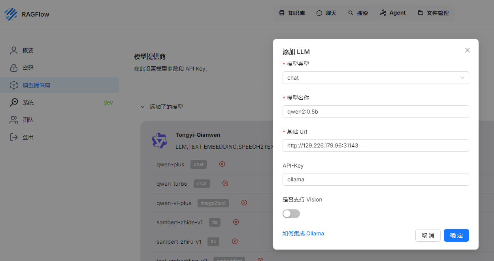
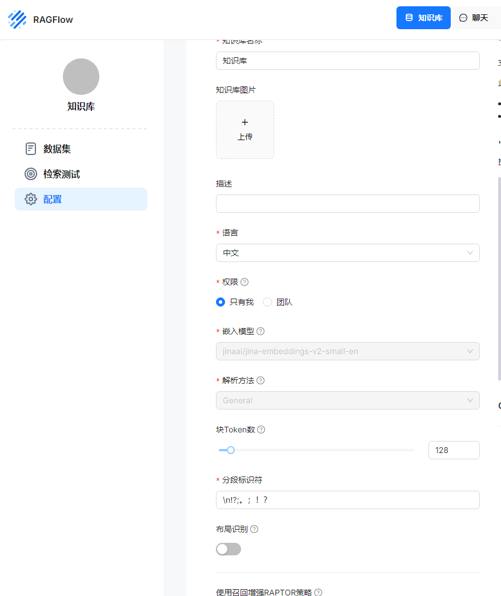
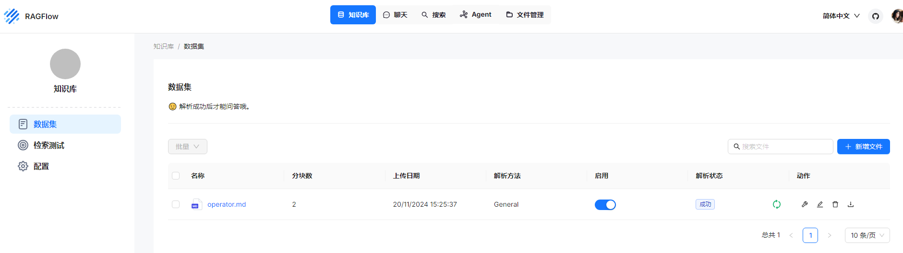
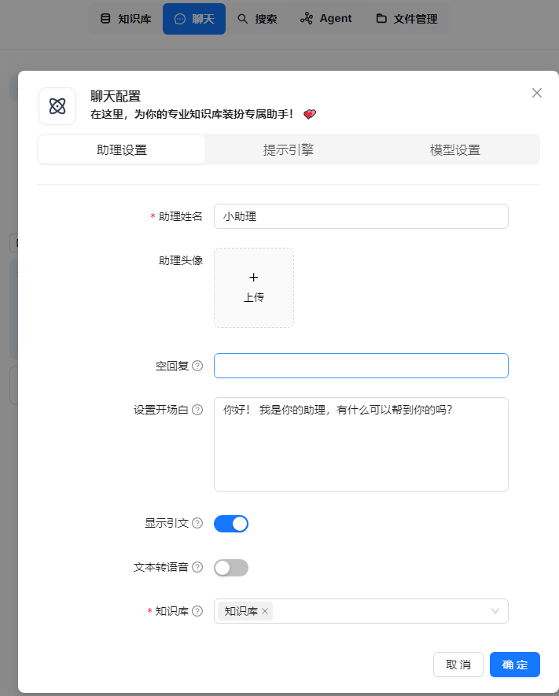
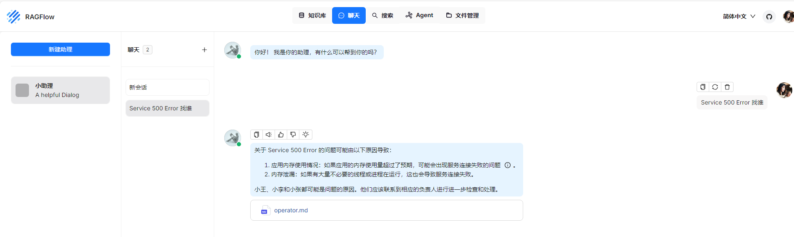
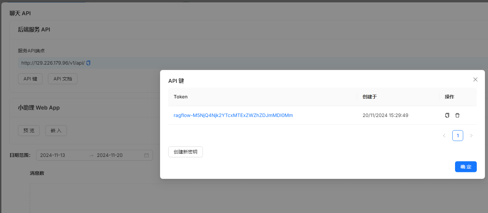

# iac_ragflow
```
export TF_VAR_secret_key=XXX
export TF_VAR_secret_id=XXX
terraform apply --auto-approve
......
Apply complete! Resources: 24 added, 0 changed, 0 destroyed.

Outputs:

kube_config = "./config.yaml"
public_ip = "129.226.179.96"
ragflow_ip = "http://129.226.179.96"
vm_password = "password123"             
```

```
export KUBECONFIG=config.yaml
kubectl get po
NAME                      READY   STATUS    RESTARTS   AGE
ollama-75c96dbcc5-dvrxz   1/1     Running   0          4m49s
```

```
curl http://129.226.179.96:31143/api/chat -d '{
  "model": "qwen2:0.5b",
  "messages": [
    {
      "role": "system",
      "content": "以海盗的口吻简单作答。"
    },
    {
      "role": "user",
      "content": "天空为什么是蓝色的？"
    }
  ],
  "stream": false
}'
{"model":"qwen2:0.5b","created_at":"2024-11-20T07:06:32.04647927Z","message":{"role":"assistant","content":"天空之所以是蓝色的，是因为水分子会散射太阳光中的波长较短的蓝光，并吸收波长较长的红、橙光线，使我们能看到的天空呈现蓝色。这种现象叫做折射现象。"},"done_reason":"stop","done":true,"total_duration":2110354925,"load_duration":16541418,"prompt_eval_count":28,"prompt_eval_duration":303000000,"eval_count":48,"eval_duration":1269000000}
```

##### 添加模型


##### 添加知识库


##### 添加数据集


##### 添加助理


##### 聊天


##### 获取 Token



# operator
```
go mod init rag-log-operator
go: creating new go.mod: module rag-log-operator
```

```
kubebuilder init --domain=aiops.com
INFO Writing kustomize manifests for you to edit...
INFO Writing scaffold for you to edit...
INFO Get controller runtime:
$ go get sigs.k8s.io/controller-runtime@v0.19.0
INFO Update dependencies:
$ go mod tidy
Next: define a resource with:
$ kubebuilder create api
```

```
kubebuilder create api --group log --version v1 --kind RagLogPilot
INFO Create Resource [y/n]
y
INFO Create Controller [y/n]
y
INFO Writing kustomize manifests for you to edit...
INFO Writing scaffold for you to edit...
INFO api/v1/raglogpilot_types.go
INFO api/v1/groupversion_info.go
INFO internal/controller/suite_test.go
INFO internal/controller/raglogpilot_controller.go
INFO internal/controller/raglogpilot_controller_test.go
INFO Update dependencies:
$ go mod tidy
INFO Running make:
$ make generate
mkdir -p /home/ymin/git/SpaceStarX/AIOps/module_9/demo_4/operator/bin
Downloading sigs.k8s.io/controller-tools/cmd/controller-gen@v0.16.4
/home/ymin/git/SpaceStarX/AIOps/module_9/demo_4/operator/bin/controller-gen object:headerFile="hack/boilerplate.go.txt" paths="./..."
Next: implement your new API and generate the manifests (e.g. CRDs,CRs) with:
$ make manifests
```

update api/v1/raglogpilot_types.go

update internal/controller/raglogpilot_controller.go

```
make manifests
/home/ymin/git/SpaceStarX/AIOps/module_9/demo_4/operator/bin/controller-gen rbac:roleName=manager-role crd webhook paths="./..." output:crd:artifacts:config=config/crd/bases
```

```
make install
/home/ymin/git/SpaceStarX/AIOps/module_9/demo_4/operator/bin/controller-gen rbac:roleName=manager-role crd webhook paths="./..." output:crd:artifacts:config=config/crd/bases
Downloading sigs.k8s.io/kustomize/kustomize/v5@v5.4.3
/home/ymin/git/SpaceStarX/AIOps/module_9/demo_4/operator/bin/kustomize build config/crd | kubectl apply -f -
customresourcedefinition.apiextensions.k8s.io/raglogpilots.log.aiops.com created
```

update config/samples/log_v1_raglogpilot.yaml

```
kubectl apply -f config/samples/log_v1_raglogpilot.yaml
kubectl apply -f ../deployment/deployment.yaml         
```

```
make run
/home/ymin/git/SpaceStarX/AIOps/module_9/demo_4/operator/bin/controller-gen rbac:roleName=manager-role crd webhook paths="./..." output:crd:artifacts:config=config/crd/bases
/home/ymin/git/SpaceStarX/AIOps/module_9/demo_4/operator/bin/controller-gen object:headerFile="hack/boilerplate.go.txt" paths="./..."
go fmt ./...
go vet ./...
go run ./cmd/main.go
2024-11-20T16:40:03+08:00       INFO    setup   starting manager
2024-11-20T16:40:03+08:00       INFO    starting server {"name": "health probe", "addr": "[::]:8081"}
2024-11-20T16:40:03+08:00       INFO    Starting EventSource    {"controller": "raglogpilot", "controllerGroup": "log.aiops.com", "controllerKind": "RagLogPilot", "source": "kind source: *v1.RagLogPilot"}
2024-11-20T16:40:03+08:00       INFO    Starting Controller     {"controller": "raglogpilot", "controllerGroup": "log.aiops.com", "controllerKind": "RagLogPilot"}
2024-11-20T16:40:03+08:00       INFO    Starting workers        {"controller": "raglogpilot", "controllerGroup": "log.aiops.com", "controllerKind": "RagLogPilot", "worker count": 1}
url:  http://129.226.179.96/v1/api/new_conversation?user_id=80cf041d-3d80-4723-87e4-4f5864deb73c
data:  map[dialog_id:c15c8d9ca71011efaf670242ac120006 id:0977418aa71b11efa2000242ac120006 message:[map[content:你好！ 我是你的助理，有什么可以帮到你的吗？ role:assistant]] user_id:80cf041d-3d80-4723-87e4-4f5864deb73c]
id:  0977418aa71b11efa2000242ac120006
combinedErrorLog:  2024-11-20 08:39:50.667 [ERROR] Database connection failed: Unable to connect to database at 'db.payment.local'.
200
2024-11-20T16:40:12+08:00       INFO    RAG system response     {"controller": "raglogpilot", "controllerGroup": "log.aiops.com", "controllerKind": "RagLogPilot", "RagLogPilot": {"name":"raglogpilot-sample","namespace":"default"}, "namespace": "default", "name": "raglogpilot-sample", "reconcileID": "afac5c85-aed4-4209-9dfe-32a8decb671a", "answer": "关于数据库连接失败的问题，请检查以下内容：\n1. 检查数据库是否正常运行。\n2. 数据库配置是否正确。如果问题仍然存在，请联系对应的服务负责人小王或小李。\n\n对于服务500错误的处理方法如下：\n\n- 如果是下游服务500错误，需要找到对应的故障原因并进行相应的修复工作。\n- 对于内存溢出的问题，可以尝试提高容器内的应用内存限制来解决。"}
combinedErrorLog:  2024-11-20 08:39:50.667 [ERROR] Database connection failed: Unable to connect to database at 'db.payment.local'.
200
2024-11-20T16:40:19+08:00       INFO    RAG system response     {"controller": "raglogpilot", "controllerGroup": "log.aiops.com", "controllerKind": "RagLogPilot", "RagLogPilot": {"name":"raglogpilot-sample","namespace":"default"}, "namespace": "default", "name": "raglogpilot-sample", "reconcileID": "d60d283e-77c5-40eb-84a0-23715bdd039e", "answer": "关于数据库连接失败的问题，请检查以下内容：\n1. 检查数据库是否正常运行。\n2. 数据库配置是否正确。如果发现任何问题，请联系对应的服务负责人小王或小李。\n\n对于服务500错误的处理方法如下：\n\n- 如果是下游服务500错误，需要找对应的业务部门负责人进行检查和解决。\n- 对于内存溢出的问题，可以尝试提高容器内的应用内存限制来防止这种情况发生。"}
combinedErrorLog:  2024-11-20 08:39:50.667 [ERROR] Database connection failed: Unable to connect to database at 'db.payment.local'.
200
2024-11-20T16:40:48+08:00       INFO    RAG system response     {"controller": "raglogpilot", "controllerGroup": "log.aiops.com", "controllerKind": "RagLogPilot", "RagLogPilot": {"name":"raglogpilot-sample","namespace":"default"}, "namespace": "default", "name": "raglogpilot-sample", "reconcileID": "e672a2e1-e189-4391-bc8e-8cb67cfa6d32", "answer": "数据库连接失败，请检查数据库是否正常运行。在配置时需要确保账号密码正确无误，并且服务的端口号和路径设置合理。如果问题仍然存在，则可能是应用内存使用过低或者有其他错误导致的服务无法正常工作。\n\n关于小王、小李以及小张，他们分别代表哪个服务？"}
combinedErrorLog:  2024-11-20 08:39:50.667 [ERROR] Database connection failed: Unable to connect to database at 'db.payment.local'.
200
2024-11-20T16:41:25+08:00       INFO    RAG system response     {"controller": "raglogpilot", "controllerGroup": "log.aiops.com", "controllerKind": "RagLogPilot", "RagLogPilot": {"name":"raglogpilot-sample","namespace":"default"}, "namespace": "default", "name": "raglogpilot-sample", "reconcileID": "5c4e0f53-bde6-4350-8c83-774c0c653060", "answer": "数据库连接失败，请检查数据库是否正常运行。在配置时需要确保账号密码正确无误，并且服务的端口和路径设置也应与实际应用一致。如果问题仍然存在，则可能是由于应用程序内存使用过量或系统资源不足导致 的错误。\n\n关于小王、小李和小张的服务，他们分别负责的是支付处理、用户处理和服务请求处理等业务。如果你的小王或者小李遇到类似的问题，请联系他提高容器内的服务配置限制以防止数据泄露。"}
combinedErrorLog:  2024-11-20 08:39:50.667 [ERROR] Database connection failed: Unable to connect to database at 'db.payment.local'.
200
2024-11-20T16:42:02+08:00       INFO    RAG system response     {"controller": "raglogpilot", "controllerGroup": "log.aiops.com", "controllerKind": "RagLogPilot", "RagLogPilot": {"name":"raglogpilot-sample","namespace":"default"}, "namespace": "default", "name": "raglogpilot-sample", "reconcileID": "354d318a-2078-4ac8-9499-b3f3cf9dbe37", "answer": "关于数据库连接失败的问题，请检查以下内容：\n1. 检查数据库是否正常运行。\n2. 使用正确的账号密码登录到数据库服务器。如果问题仍然存在，请联系对应的服务负责人小王或小李。\n\n对于服务500错误的处理方法如下：\n\n1. 如果是下游服务导致的，需要查看应用内存使用情况并检查是否存在内存泄漏等问题。\n2. 请联系对应的业务部门（如支付、用户等）寻求帮助。"}
combinedErrorLog:  2024-11-20 08:41:50.726 [ERROR] Database connection failed: Unable to connect to database at 'db.payment.local'.
2024-11-20 08:41:52.728 [ERROR] Service 500 Error: Downstream service 'order-processing' returned status code 500.
2024-11-20 08:41:54.730 [ERROR] Memory OOM: Container 'payment-service' exceeded memory limit.
2024-11-20 08:42:04.735 [ERROR] Fraud detection failed: Payment flagged as potentially fraudulent.
2024-11-20 08:42:10.740 [ERROR] Database connection failed: Unable to connect to database at 'db.payment.local'.
2024-11-20 08:42:12.741 [ERROR] Service 500 Error: Downstream service 'order-processing' returned status code 500.
2024-11-20 08:42:14.743 [ERROR] Memory OOM: Container 'payment-service' exceeded memory limit.
2024-11-20 08:42:24.750 [ERROR] Fraud detection failed: Payment flagged as potentially fraudulent.
......
```

